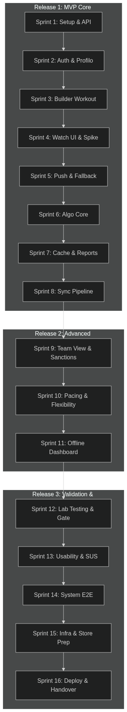

# Release Roadmap

La Release Roadmap definisce la schedulazione temporale dei rilasci e la suddivisione del Product Backlog in cicli iterativi di sviluppo (Sprint). Il progetto si articola su un orizzonte temporale di **8 mesi** suddiviso in **16 Sprint di 2 settimane ciascuno**, raggruppati in 3 release principali coerenti con le dipendenze logiche e architetturali.

---

## 1. Strategia Generale di Rilascio e Dipendenze

La pianificazione segue una logica di **disaccoppiamento architetturale** e **mitigazione del rischio tecnologico**:
1.  **Release 1: MVP Core Ecosistema (Sprint 1-8):** Include il setup dell'architettura e del database, la profilazione utenti e il workout builder (Fase 1: Foundation), unitamente all'applicazione smartwatch nativa con l'algoritmo di tracciamento automatico, il fallback manuale e le pipeline di sincronizzazione (Fase 2: Core Wearable). Questa release rappresenta il Minimum Viable Product, permettendo l'esecuzione end-to-end e la sincronizzazione di un allenamento reale.
2.  **Release 2: Advanced Analytics & Flexibility (Sprint 9-11):** Include la visualizzazione comparativa del team, i grafici di pacing, la gestione delle sanzioni a posteriori e la dashboard offline, oltre a skip e riordino stazioni su watch.
3.  **Release 3: Validation & Store Launch (Sprint 12-16):** Fasi di test intensivi in laboratorio e sul campo, validazione dell'usabilità SUS, deploy dell'infrastruttura cloud di produzione, revisione store e consegna del progetto.

---

## 2. Schedulazione dei 16 Sprint

### Fase 1: Inizializzazione e Architettura (Sprint 1 - 3) — *Mesi 1-2*
*Focus:* Definizione delle fondamenta tecniche, sicurezza e protocollo di base.

*   **Sprint 1: Setup Infrastrutturale & Data Modeling (10 SP)**
    *   *User Stories:* US-TEC-01 (Setup CI/CD - 5 SP), US-TEC-02 (Modello Dati e API - 5 SP).
    *   *Obiettivo Sprint:* Repository configurati con pipeline CI/CD attive, schema DB definito e specifiche API Swagger approvate dal Tech Lead per garantire l'allineamento tra gli sviluppatori.
*   **Sprint 2: Sicurezza, ACL e Profilo Utente (8 SP)**
    *   *User Stories:* US-D-01 (Autenticazione e ACL - 5 SP), US-D-02 (Profilazione Atleta e Categoria Gara - 3 SP).
    *   *Obiettivo Sprint:* Flusso di login e registrazione funzionanti, con differenziazione dei ruoli Coach/Atleta a livello di backend e frontend.
*   **Sprint 3: Workout Builder (8 SP)**
    *   *User Stories:* US-D-06 (Builder Workout e Template - 8 SP).
    *   *Obiettivo Sprint:* Il coach può creare workout e salvarli come template su DB.

### Fase 2: Sviluppo Wearable e Riconoscimento Core (Sprint 4 - 8) — *Mesi 3-4*
*Focus:* Sviluppo dell'applicazione smartwatch e dell'algoritmo di tracciamento.

*   **Sprint 4: Watch UI & Spike Riconoscimento Sensori (10 SP)**
    *   *User Stories:* US-W-01 (UI Base ad Alto Contrasto - 5 SP), US-TEC-03 (Spike Tecnologico - Raccolta Dati - 5 SP).
    *   *Obiettivo Sprint:* Layout grafico dello smartwatch pronto per l'uso sotto sforzo. Raccolta delle prime sessioni di dati grezzi da accelerometro/giroscopio per addestrare il modello di riconoscimento.
*   **Sprint 5: Push Protocol & Fallback Trigger (13 SP)**
    *   *User Stories:* US-S-03 (Invio in Push del Workout - 8 SP), US-W-03 (Transizione Manuale - Fallback - 5 SP).
    *   *Obiettivo Sprint:* Implementazione del push del workout allo smartwatch e del fallback manuale tramite gesti fisici sul watch in caso di mancato rilevamento dell'algoritmo.
*   **Sprint 6: Algoritmo Core Riconoscimento (13 SP)**
    *   *User Stories:* US-W-04 (Algoritmo Riconoscimento - Modello Core - 13 SP).
    *   *Obiettivo Sprint:* Prima release stabile dell'algoritmo di tracciamento automatico integrata con la schedulazione.
*   **Sprint 7: Local Storage, Note & Reports (14 SP)**
    *   *User Stories:* US-W-05 (Caching Locale - Offline-First - 8 SP), US-W-02 (Visualizzazione Note Coach - 3 SP), US-W-06 (Report Locale Post-Workout - 3 SP).
    *   *Obiettivo Sprint:* Scrittura continua su cache locale, visualizzazione note coach sul watch e report locale di fine sessione attivo.
*   **Sprint 8: Pipeline Sincronizzazione Dati (10 SP)**
    *   *User Stories:* US-S-01 (Sincronizzazione Bluetooth Watch -> Phone - 5 SP), US-S-02 (Sincronizzazione Phone -> Cloud - 5 SP).
    *   *Obiettivo Sprint:* Trasferimento automatico del file di allenamento dall'orologio al telefono via Bluetooth e successivo upload automatico sul cloud del server dashboard.

### Fase 3: Analisi Avanzata e Flessibilità (Sprint 9 - 11) — *Mesi 5-6*
*Focus:* Sviluppo dei moduli di analisi delle performance e flessibilità d'uso.

*   **Sprint 9: Visualizzazione Team & Gestione Sanzioni (13 SP)**
    *   *User Stories:* US-D-03 (Visualizzazione Comparativa Team - 8 SP), US-D-05 (Gestione Sanzioni / Penalità - 5 SP).
    *   *Obiettivo Sprint:* Tabella comparativa a colonne sulla dashboard del coach e gestione delle sanzioni/no-rep a posteriori con ricalcolo dei tempi.
*   **Sprint 10: Grafici di Pacing & Flessibilità Allenamento (21 SP)**
    *   *User Stories:* US-D-04 (Motore Grafici Pacing - 8 SP), US-W-07 (Skip & Riordina Stazioni su Watch - 13 SP).
    *   *Obiettivo Sprint:* Grafici interattivi di pacing reale vs target sulla dashboard e gestione sul watch delle modifiche all'ordine del workout (skip/riordina).
*   **Sprint 11: Dashboard Offline-First (8 SP)**
    *   *User Stories:* US-D-07 (Dashboard in Modalità Offline - 8 SP).
    *   *Obiettivo Sprint:* Consultazione in sola lettura della dashboard web senza connettività tramite Service Workers ed IndexedDB locale.

### Fase 4: Integrazione, Validazione e Rilascio (Sprint 12 - 16) — *Mesi 7-8*
*Focus:* Testing di sistema su larga scala, validazione scientifica, ottimizzazione e rilascio.

*   **Sprint 12: Lab Testing & Algoritmo Gate (Go/No-Go)**
    *   *Attività:* Test intensivi di precisione e regressione dell'algoritmo (Lab Testing in palestra controllata con 15 coach e 30 atleti).
    *   *Gate Critico (Go/No-Go):* Verifica del criterio di accuratezza ≥ 90%. Se superato, si consolida l'algoritmo. Se fallito, si attiva il **Pivot al Plan B (Manual Trigger)** ottimizzando la UI per la selezione manuale rapida ed eliminando il tracciamento automatico imperfetto.
*   **Sprint 13: Usability & UI/UX Validation**
    *   *Attività:* Test di usabilità sul campo (atleti stressati fisicamente). Calcolo del punteggio SUS.
    *   *Obiettivo Sprint:* Ottenimento di un SUS Score medio ≥ 80/100. Eventuale inserimento di micro-correzioni all'interfaccia smartwatch per facilitare la lettura sotto fatica.
*   **Sprint 14: System Integration & End-to-End Testing**
    *   *Attività:* Test end-to-end sull'intera catena (Dashboard -> Push -> Watch -> Esecuzione -> Bluetooth -> Cloud -> Dashboard). Test di stabilità in caso di caduta connessione.
    *   *Obiettivo Sprint:* Assenza totale di bug critici o bloccanti nell'intero ecosistema.
*   **Sprint 15: Configurazione Infrastruttura & Store Submission**
    *   *Attività:* Setup dell'ambiente di produzione Cloud (AWS/Azure) con configurazioni di sicurezza e scalabilità. Preparazione del pacchetto app ed invio ad Apple App Store Connect per la review.
    *   *Obiettivo Sprint:* App in fase di revisione negli store e backend di produzione pronto e configurato.
*   **Sprint 16: Deployment, Documentazione e Chiusura Progetto**
    *   *Attività:* Rilascio pubblico dell'applicazione web e watchOS. Preparazione del materiale di onboarding per i nuovi clienti (video tutorial su YouTube, slide di presentazione) e della documentazione tecnica finale per la manutenzione.
    *   *Obiettivo Sprint:* Consegna formale del progetto, Sprint Retrospective finale e chiusura del ciclo di vita del progetto.
