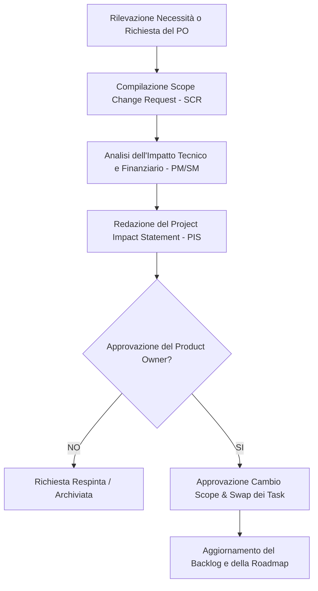

# Gestione Operativa dei Cambiamenti (Scope Change Management)

Questo documento illustra l'applicazione pratica del processo di gestione delle modifiche dello scope. Come stabilito nelle politiche di [Change Governance](file:///home/zava/Projects/PM-project/Planning/8-quality_and_change_governance.md#1-gestione-empirica-dei-cambiamenti-scope-control) definite in fase di pianificazione, qualsiasi variazione segue il principio della *Fixed Capacity*. 

Di seguito viene presentata la simulazione del flusso approvativo e della prima **Richiesta di Cambiamento (Scope Change Request - SCR)** operativa del progetto, corredata dal relativo **Project Impact Statement (PIS)**.

---

## 1. Il Processo Operativo di Scope Change

Per garantire il rispetto dei vincoli di budget e di tempo (8 mesi, CapEx di €271.700), l'iter autorizzativo segue la pipeline strutturata descritta di seguito:

### Applicazione della Regola di Scambio (Fixed Capacity Trading Rule)
In base alle linee guida di pianificazione, l'aggiunta di nuove funzionalità nel Backlog deve essere compensata dalla rimozione o posticipazione di elementi di pari sforzo (misurato in Story Points). Questo garantisce che la baseline dei costi e la data di consegna finale non vengano alterate.

### 1.2 Gestione della Riserva Temporale (Time Contingency) e dello Scope Bank
Per gestire l'incertezza e l'elaborazione dei cambiamenti di scope senza inficiare il time-box fisso di 8 mesi (16 Sprint), la governance adotta due strumenti integrati:
1. **Riserva Temporale (Time Contingency):** Il team accantona il **10% della capacità temporale complessiva del progetto** (pari a circa 1.6 Sprint su 16, equivalente a circa 3 settimane di calendario). Questa riserva non viene allocata a nuove feature fin dall'inizio, ma viene mantenuta libera e distribuita come "buffer" temporale per assorbire:
   - L'impatto dei test sul campo (Field Testing e Spike).
   - Eventuali ritardi nell'approvazione delle user story complesse.
   - L'implementazione di modifiche di scope urgenti approvate tramite il processo di Change Request.
2. **Lo Scope Bank:** È un sotto-registro del Product Backlog (gestito in Jira e Confluence) in cui vengono "depositati" tutti i requisiti, le funzionalità o le idee di miglioramento emersi durante il progetto (es. nelle Sprint Review o dai feedback dei coach) che non sono inclusi nello Sprint Backlog corrente. Le voci dello Scope Bank:
   - Vengono costantemente stimate dal Dev Team in Story Points durante il Refinement.
   - Sono ordinate per priorità di business dal Product Owner.
   - Fungono da "portafoglio di scambio": se una richiesta di cambio scope viene approvata, il PO effettua un prelievo dallo Scope Bank per posizionare la nuova funzionalità nello Sprint, compensando con il deposito nello Scope Bank di storie di pari valore in Story Points attualmente pianificate nel core backlog (Regola dello Swap).

---

## 2. Simulazione: Scope Change Request (SCR)

*   **ID Richiesta:** SCR-2026-001  
*   **Data Richiesta:** 10 Febbraio 2026 (Sprint 2)  
*   **Richiedente:** Chiara Bertocchi (Product Owner / Coach)  
*   **Titolo:** Anticipazione della Flessibilità Workout (`US-W-07`) in Release 1.  

### Descrizione della Modifica Richiesta
La Product Owner rileva che durante i test preliminari svolti nei box affiliati, le palestre risultano spesso molto affollate nelle ore di punta. Gli atleti non possono seguire la sequenza lineare e rigida delle 8 stazioni Hyrox senza attendere che i macchinari si liberino. Di conseguenza, la funzionalità di **Skip & Riordina Stazioni (`US-W-07`)**, inizialmente pianificata come *COULD* per la Release 2 (Sprint 10), diventa un fattore critico di adozione (MUST) e deve essere inclusa nella **Release 1 (MVP)** per consentire l'utilizzo reale sul campo.

---

## 3. Project Impact Statement (PIS)

*   **Compilato da:** Andrea Zavatta (Scrum Master / PM)  
*   **Data Analisi:** 12 Febbraio 2026  

### 3.1 Analisi dell'Impatto sullo Sforzo (Story Points)
L'inserimento della storia `US-W-07 (Skip & Riordina Stazioni)` comporta una complessità stimata di **13 Story Points**, a causa della necessità di riscrivere la macchina a stati dello smartwatch per gestire deviazioni dal percorso pianificato e riallineare i dati telemetrici.

### 3.2 Strategia di Mitigazione (The Agile Swap)
Per evitare lo slittamento dei tempi della Release 1 e rispettare la pianificazione finanziaria, lo Scrum Master e Giovanni Manca (Tech Lead) propongono di **scambiare (swap)** la storia richiesta con tre funzionalità non bloccanti della Release 1, posticipandole alla Release 2.

**Storie da Inserire in Release 1:**
*   `US-W-07 (Skip & Riordina Stazioni su Watch)` $\rightarrow$ **+13 Story Points**

**Storie da Posticipare alla Release 2 (Sforzo Equivalente):**
*   `US-W-05 (Caching Locale - Offline-First)` [Parziale] $\rightarrow$ **-8 Story Points** (Si implementa una cache minima di 1 ora anziché 5 ore persistenti su SQLite per l'MVP).
*   `US-D-02 (Profilazione Fisiologica e Gara)` $\rightarrow$ **-3 Story Points** (I parametri cardiaci dell'atleta saranno preimpostati con valori standard di default; il form di profilazione web viene spostato alla Release 2).
*   `US-W-02 (Visualizzazione Note Coach)` $\rightarrow$ **-3 Story Points** (L'atleta non visualizzerà le note testuali del coach sullo schermo del watch in Release 1).

*Bilancio Netto dello Sforzo:* $+13 - 8 - 3 - 3 = \mathbf{-1\ Story\ Point}$ per la Release 1. La schedulazione e il budget dell'MVP sono protetti.

### 3.3 Impatto sui Rischi
L'inserimento del riordino delle stazioni aumenta la complessità del codice dell'applicazione watchOS. Giovanni Manca (Tech Lead) stima un potenziale incremento dei bug logici nella gestione delle transizioni automatiche. 
*   *Mitigazione:* La logica di fallback manuale (`US-W-03`) sarà testata con maggiore frequenza nello Sprint 5 per garantire che l'atleta possa forzare la transizione se il riordino confonde l'algoritmo.

---

## 4. Esito e Firme di Approvazione

La modifica proposta nel Project Impact Statement è stata valutata e approvata dalle parti. La baseline del Product Backlog viene aggiornata di conseguenza.

*   **Approvato da (Product Owner):** *Chiara Bertocchi* (Firma digitale registrata il 14 Feb 2026)  
*   **Approvato da (Scrum Master):** *Andrea Zavatta* (Firma digitale registrata il 14 Feb 2026)

---

## Appendice: Modelli Standard (Blank Forms) ad uso del PM Audit

Di seguito vengono riportati i template formali vuoti, in linea con gli standard metodologici di Wysocki, per la gestione delle richieste di variazione dello scope di progetto.

### 1. Scope Change Request Form (Template)

| **Identificazione Richiesta** | |
| :--- | :--- |
| **ID Richiesta:** `SCR-[AAAA]-[XXX]` | **Data Richiesta:** `[GG/MM/AAAA]` |
| **Richiedente (Nome & Ruolo):** | `[Nome del Richiedente - es. PO, Coach, Stakeholder]` |
| **Titolo della Modifica:** | `[Breve titolo descrittivo]` |
| **Dettaglio della Modifica** | |
| **Descrizione del Cambiamento:** | *[Descrivere in dettaglio la modifica richiesta, specificando se si tratta di una nuova funzionalità, una rimozione o una modifica di requisiti esistenti]* |
| **Giustificazione di Business:** | *[Spiegare il motivo della modifica e il valore aggiunto per gli utenti finali (atleti o coach), es. variazioni normative, feedback sul campo, impedimenti tecnologici]* |
| **Elementi Backlog Impattati:** | *[Indicare eventuali Epiche o User Story già esistenti che vengono influenzate da questa richiesta]* |
| **Data Limite per la Risposta:** | `[GG/MM/AAAA] (Necessaria per la valutazione degli impatti sullo Sprint corrente)` |
| **Firma del Richiedente:** | *`[Firma o sigla]`* |

---

### 2. Project Impact Statement Form (Template)

| **Dati di Riferimento** | | | |
| :--- | :--- | :--- | :--- |
| **ID PIS:** `PIS-[AAAA]-[XXX]` | **Riferimento SCR:** `SCR-[AAAA]-[XXX]` | **Data Analisi:** `[GG/MM/AAAA]` | **Compilato da:** `[PM / Scrum Master]` |
| **Valutazione di Impatto** | | | |
| **Impatto sullo Sforzo (SP):** | `[Stima dei Story Points aggiuntivi stimati dal Dev Team]` | | |
| **Impatto Economico (€):** | `[Variazione dei costi del personale o infrastrutturali, se presenti]` | | |
| **Impatto sui Tempi (Release):** | `[Indica se la data di rilascio dell'MVP o della Milestone subisce variazioni]` | | |
| **Impatto sulla Qualità / DoD:** | `[Indica se sono richiesti nuovi standard di test, es. hardware specifico o certificazioni]` | | |
| **Strategia di Mitigazione (The Agile Swap - Fixed Capacity)** | | | |
| **Storie da Inserire (+ SP):** | `[ID Storia - Titolo - SP]` | **Storie da Rimuovere / Posticipare (- SP):** | `[ID Storia - Titolo - SP]` |
| **Bilancio Netto Sforzo (SP):** | `[Sforzo netto finale, deve essere <= 0 per non alterare la baseline di Sprint]` | | |
| **Impatto sui Rischi** | | | |
| **Rischi Aggiuntivi Rilevati:** | *[Identificare se il cambiamento introduce nuovi rischi di regressione, instabilità o ritardi tecnologici]* | | |
| **Strategia di Mitigazione Rischi:** | *[Azioni preventive da intraprendere, es. spike aggiuntivi, test mirati, branch dedicati]* | | |
| **Possibile Esito dell'Analisi (Selezionare l'opzione concordata)** | | | |
| `[ ]` **Esito A:** | Il cambiamento può essere applicato entro le risorse e i tempi previsti per il progetto (Swap a sforzo zero). | | |
| `[ ]` **Esito B:** | Il cambiamento può essere applicato, ma richiederà un'estensione della schedula (Slittamento milestone). | | |
| `[ ]` **Esito C:** | Il cambiamento può essere applicato entro la schedula prevista, ma sono necessarie ulteriori risorse finanziarie. | | |
| `[ ]` **Esito D:** | Il cambiamento richiede sia estensione temporale che risorse aggiuntive. | | |
| `[ ]` **Esito E:** | Il cambiamento sarà gestito con strategia "Multiple Release" (spostato a una release successiva). | | |
| `[ ]` **Esito F:** | Il cambiamento non può essere applicato (Richiesta Respinta). | | |
| **Firme per l'Approvazione Formale** | | | |
| **Firma Product Owner:** | *`[Firma digitale]`* | **Data Approvazione:** | `[GG/MM/AAAA]` |
| **Firma Scrum Master / PM:** | *`[Firma digitale]`* | **Data Approvazione:** | `[GG/MM/AAAA]` |
| **Firma Technical Leader:** | *`[Firma digitale]`* | **Data Approvazione:** | `[GG/MM/AAAA]` |
