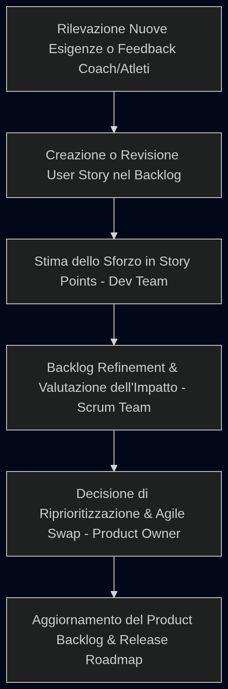

# Gestione e Adattamento dello Scope (Product Backlog Refinement & Agile Swap)

Questo documento illustra l'applicazione pratica del processo di gestione e adattamento dello scope durante l'esecuzione del progetto. Come stabilito nelle politiche di [Change Governance](file:///home/zava/Projects/PM-project/Planning/8-quality_and_change_governance.md#1-gestione-empirica-dei-cambiamenti-scope-control) definite in fase di pianificazione, lo sviluppo segue le regole di una metodologia ibrida basata su Scrum: il cambiamento è accolto come un'opportunità, non esistono form o comitati di controllo dei cambiamenti (Change Control Board), e qualsiasi modifica al perimetro dell'incremento segue il principio del **Backlog Refinement** e della **Fixed Capacity**.

Di seguito viene presentata la simulazione dell'adattamento dello scope avvenuta durante l'esecuzione dello Sprint 2, basata sulla regola dello scambio agile (**Agile Swap**) delle storie e registrata nel backlog.

---

## 1. Il Processo Operativo di Adattamento dello Scope

Per garantire il rispetto dei vincoli di budget e di tempo (8 mesi per 16 Sprint) senza irrigidire il perimetro del prodotto, il team applica il flusso empirico descritto di seguito:

### 1.1 La Regola di Scambio (Fixed Capacity Trading Rule)
L'aggiunta di una nuova User Story o l'anticipazione di una funzionalità a una release precedente deve essere compensata dalla rimozione o posticipazione di elementi di pari sforzo (misurato in Story Points). Questo garantisce che la baseline dei costi operativi e la timeline delle release non subiscano variazioni, proteggendo la sostenibilità del lavoro del Dev Team.

### 1.2 Gestione del Backlog: lo Scope Bank e la Riserva Temporale (Time Contingency)
L'evoluzione dinamica dello scope si appoggia su due strumenti integrati:
1.  **Lo Scope Bank:** È un sotto-registro del Product Backlog (gestito sulla Jira Board) in cui risiedono i requisiti di priorità inferiore (`COULD` o `SHOULD`) o le nuove idee non ancora pianificate per lo Sprint corrente. Se una nuova storia viene inserita, il PO effettua un prelievo dallo Scope Bank per posizionare la nuova funzionalità nella release corrente, compensando con il deposito nello Scope Bank di storie di pari valore in Story Points attualmente pianificate nel core backlog (Agile Swap).
2.  **Riserva Temporale (Time Contingency):** Il team mantiene un buffer del **10% della capacità temporale complessiva del progetto** (pari a circa 1.6 Sprint su 16) non allocato a feature fin dall'inizio, gestito per assorbire i ritardi di stima, lo Spike iniziale e i test di usabilità.

---

## 2. Simulazione: Adattamento dello Scope nello Sprint 2

*   **Data dell'Evento:** 18 Febbraio 2026 (Sprint 2)
*   **Contesto:** Durante le sessioni preliminari di test nei box affiliati (Sprint 2), il Product Owner (Chiara Bertocchi) raccoglie il feedback dei coach e degli atleti sul campo: le palestre sono spesso affollate e gli atleti non riescono a seguire la sequenza lineare e rigida delle 8 stazioni Hyrox senza dover attendere che i macchinari si liberino.
*   **Esigenza di Scope:** La funzionalità di **Skip & Riordina Stazioni (`US-W-07`)**, inizialmente pianificata come `COULD` per la Release 2 (Sprint 10), diventa critica per il valore dell'MVP (Release 1) e deve essere anticipata.

---

## 3. Analisi di Impatto e Applicazione dell'Agile Swap

Il Product Owner convoca una sessione straordinaria di **Backlog Refinement** con lo Scrum Team per analizzare la modifica dello scope.

### 3.1 Stima e Valutazione Tecnica del Dev Team
Il Tech Lead e il Dev Team stimano la complessità di `US-W-07 (Skip & Riordina Stazioni su Watch)` in **13 Story Points**, dovuta alla necessità di modificare la macchina a stati dell'applicazione watchOS per riallineare i dati di telemetria in caso di stazioni non sequenziali.
*   **Impatto sui Rischi:** L'inserimento aumenta la complessità del codice dell'app per smartwatch. Come mitigazione, il team decide di testare la logica di fallback manuale (`US-W-03`) con maggiore frequenza nello Sprint 5.

### 3.2 Applicazione dello Scambio Agile (The Agile Swap)
Per mantenere intatta la capacità dello Sprint e salvaguardare il rilascio della Release 1 (MVP) entro lo Sprint 8, il Product Owner applica la regola della *Fixed Capacity*, posticipando alla Release 2 tre storie non bloccanti dello stesso peso complessivo:

*   **User Story Inserita (Release 1):**
    *   `US-W-07 (Skip & Riordina Stazioni su Watch)` $\rightarrow$ **+13 Story Points**
*   **User Story Spostate a Release 2 (Scope Bank):**
    *   `US-W-05 (Caching Locale - Offline-First)` [Parziale] $\rightarrow$ **-8 Story Points** (si implementa una cache minima di 1 ora anziché di 5 ore persistenti su SQLite per l'MVP).
    *   `US-D-02 (Profilazione Fisiologica e Gara)` $\rightarrow$ **-3 Story Points** (i parametri cardiaci dell'atleta saranno impostati con valori standard di default; la schermata web di profilazione viene posticipata).
    *   `US-W-02 (Visualizzazione Note Coach)` $\rightarrow$ **-3 Story Points** (l'atleta non visualizzerà le note testuali del coach sul quadrante dell'orologio in Release 1).

*Bilancio Netto dello Sforzo per l'MVP:* $+13 - 8 - 3 - 3 = \mathbf{-1\ Story\ Point}$. La capacità dello Sprint è protetta, il budget e la roadmap temporale rimangono invariati. L'aggiornamento viene registrato direttamente nel Product Backlog da parte del PO.

---

## 4. Registro degli Adattamenti dello Scope (Agile Swap Log)

Di seguito viene mostrato l'aggiornamento formale del registro degli scambi agili effettuati sul Product Backlog durante la fase esecutiva:

| ID Swap | Data | Sprint | User Story Aggiunta / Anticipata | SP (+) | User Story Rimossa / Posticipata | SP (-) | Bilancio Netto (SP) | Decisione PO & Note |
| :--- | :--- | :--- | :--- | :---: | :--- | :---: | :---: | :--- |
| **SWAP-01** | 19 Feb 2026 | Sprint 2 | `US-W-07` (Skip & Riordina Stazioni) | +13 SP | `US-W-05` (Caching parziale) `US-D-02` (Profilazione fisiologica) `US-W-02` (Note coach su Watch) | -8 SP -3 SP -3 SP | **-1 SP** | **Approvato da PO (C. Bertocchi):** Necessario per palestre affollate. Baseline MVP protetta. |

---

