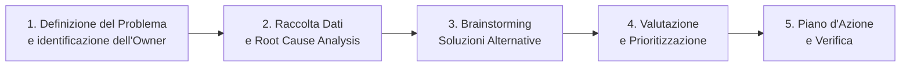
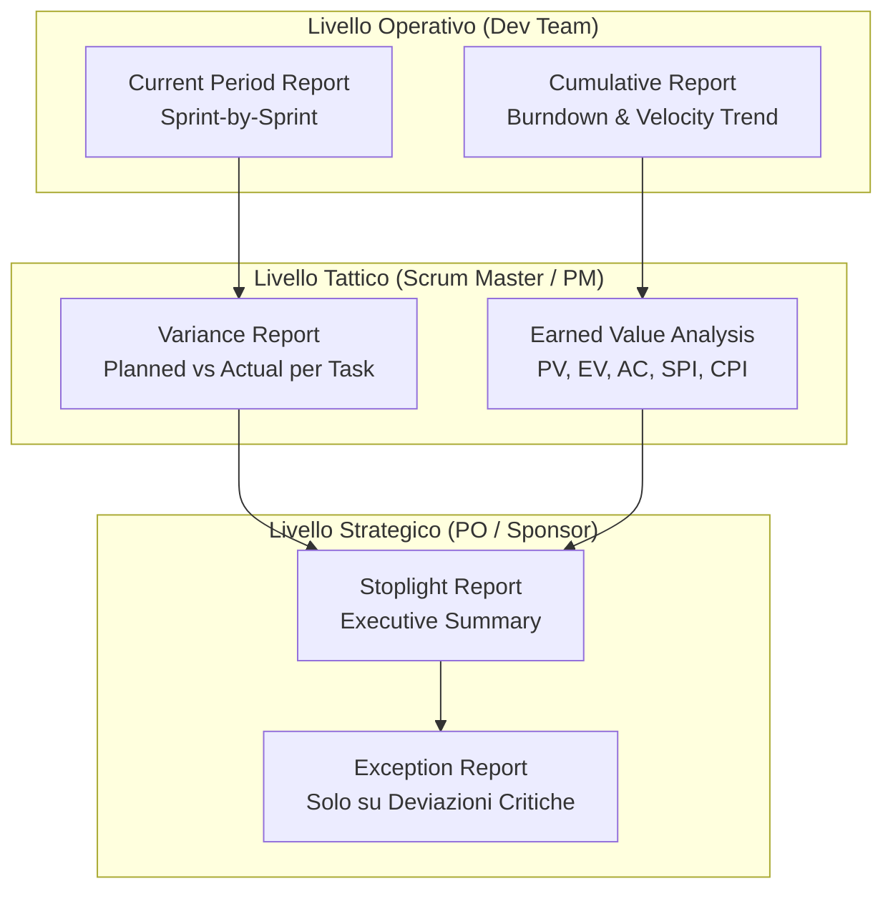

# Sistema di Project Status Meetings e Reporting

Il presente documento definisce la struttura dei meeting di stato, il sistema di reporting stratificato e gli strumenti di monitoraggio visuale adottati dal team durante l'esecuzione del progetto "Hyrox Team Performance Optimizer".
---

## 1. Architettura dei Project Status Meetings

Il monitoraggio del progetto si articola su tre livelli di riunioni, ciascuno con frequenza, partecipanti e formato distinti, in linea con le [regole operative del team](file:///home/zava/Projects/PM-project/Launching/1-kickoff_meeting.md#32-formalizzazione-delle-regole-operative-del-team-working-agreements) stabilite nel Kick-Off Meeting.

### 1.1 Daily Status Meeting (Daily Scrum) — 15 Minuti

| **Caratteristica** | **Dettaglio** |
| :--- | :--- |
| **Frequenza** | Giornaliera (Lun-Ven, ore 09:15) |
| **Durata** | 15 minuti (timebox rigido) |
| **Formato** | In piedi (*standup*), sincrono (Miro Board + Jira Board visibile) |
| **Partecipanti** | Intero Scrum Team (PO, SM, Dev Team) |
| **Facilitatore** | Scrum Master (Andrea Zavatta) |

**Agenda fissa (per ciascun membro del Dev Team):**
1.  *"Cosa ho completato ieri?"* — Aggiornamento dei task su Jira (spostamento da *In Progress* a *Done*).
2.  *"Cosa farò oggi?"* — Identificazione del task successivo e stima delle ore rimanenti.
3.  *"Quali impedimenti ho?"* — Segnalazione di blocchi operativi o tecnici che richiedono l'intervento dello Scrum Master o la convocazione di un Problem Resolution Meeting.

**Azioni di Monitoraggio durante il Daily:**
*   Aggiornamento dello **stato dei task sul Burndown Chart** dello Sprint (automatico da Jira).
*   Aggiornamento dello **Scope Bank** in caso di risparmio o consumo di capacità durante lo Sprint.
*   Registrazione di nuove **issue** nell'[Issues Log](file:///home/zava/Projects/PM-project/Monitoring_Controlling/3-issues_log_escalation.md), se emerse.
*   Verifica della coerenza tra il **tempo registrato su Tempo (Jira)** e il Focus Factor pianificato del 75%.

> [!IMPORTANT]
> **Regola operativa (dal Kick-Off):** Le discussioni tecniche risolutive sono tassativamente escluse dal Daily Scrum. Qualsiasi problema che richieda approfondimento viene rimandato a un *Problem Resolution Meeting* dedicato.

---

### 1.2 Problem Resolution Meeting — Ad-hoc

| **Caratteristica** | **Dettaglio** |
| :--- | :--- |
| **Frequenza** | Su richiesta, tipicamente entro 24h dall'impedimento segnalato |
| **Durata** | 30-60 minuti (adattata alla complessità del problema) |
| **Formato** | Seduti, con supporto visivo (Miro Board per brainstorming) |
| **Partecipanti** | Solo i membri del team direttamente coinvolti nel problema + SM come facilitatore |

**Processo strutturato (Modello a 5 passi di Daniel Couger):**
Il team adotta il modello di problem solving formalizzato nel Kick-Off Meeting:



**Output del meeting:**
*   Aggiornamento dell'[Issues Log](file:///home/zava/Projects/PM-project/Monitoring_Controlling/3-issues_log_escalation.md) con la soluzione concordata, il responsabile e la data di risoluzione prevista.
*   Se il problema non è risolvibile internamente, attivazione della [Problem Escalation Strategy](file:///home/zava/Projects/PM-project/Monitoring_Controlling/3-issues_log_escalation.md#3-problem-escalation-strategy).
*   Pianificazione del meeting successivo, se necessario.

---

### 1.3 Sprint Review Meeting (Project Review Meeting)

| **Caratteristica** | **Dettaglio** |
| :--- | :--- |
| **Frequenza** | Ogni 2 settimane (fine Sprint) |
| **Durata** | 90 minuti (timebox) |
| **Formato** | Demo live del software funzionante + discussione feedback |
| **Partecipanti** | Scrum Team + PO (Chiara Bertocchi) + Stakeholder esterni (Coach di test) |

**Agenda:**
1.  **Demo dell'Incremento:** Il Dev Team presenta il software funzionante completato nello Sprint, confrontandolo con lo Sprint Goal definito nello Sprint Planning.
2.  **Analisi delle Metriche di Sprint:** Revisione del Burndown Chart, della velocity effettiva (Story Points completati) e confronto con la velocity pianificata.
3.  **Raccolta Feedback:** I coach e gli atleti di test forniscono feedback diretto sulle funzionalità rilasciate (usabilità, utilità percepita, problemi riscontrati).
4.  **Aggiornamento del Product Backlog:** Il PO riprioritizza il backlog sulla base dei feedback raccolti, applicando se necessario la regola dell'[Agile Swap](file:///home/zava/Projects/PM-project/Launching/3-scope_change_management.md).
5.  **Presentazione del Report di Stato:** Lo SM presenta il report di stato consolidato (Stoplight + Variance) al PO e agli stakeholder.

---

## 2. Sistema di Reporting Stratificato

Il sistema di reporting adotta i cinque tipi di report, differenziandoli per destinatario e livello di dettaglio.

### 2.1 Mappa degli Strumenti di Reporting



---

### 2.2 Current Period Report (Report del Periodo Corrente)

**Destinatario:** Dev Team + Scrum Master  
**Frequenza:** Alla fine di ogni Sprint (bisettimanale)  
**Strumento:** Jira Sprint Report (generato automaticamente)

Il *Current Period Report* copre esclusivamente il periodo dello Sprint appena concluso, evidenziando:
*   Le User Story completate (stato *Done*) e quelle non completate (*Carry-over*).
*   Le eventuali variazioni rispetto allo Sprint Goal pianificato e le cause.
*   Le ore effettivamente registrate su **Tempo (Jira)** vs le ore pianificate, per verificare la coerenza del Focus Factor al 75%.

#### Esempio: Current Period Report — Sprint 5

| Metrica | Pianificato | Effettivo | Variazione |
| :--- | :---: | :---: | :---: |
| **Story Points Completati** | 13 SP | 11 SP | **-2 SP** |
| **Sprint Goal Raggiunto** | Sì | Parziale | US-W-03 portata al 90% |
| **Ore Totali Dev Team** | 300h | 312h | +12h (overtime controllato) |
| **Focus Factor Reale** | 75% | 72% | -3% (overhead cerimonie Spike) |

*Nota: Lo Sprint 5 ha registrato un leggero scostamento dovuto alla complessità imprevista del test di fallback manuale (US-W-03) combinato con i risultati dello Spike (Sprint 4). Il carry-over di 2 SP è stato recuperato nello Sprint 6 senza impatto sulla Release 1.*

---

### 2.3 Cumulative Report (Report Cumulativo)

**Destinatario:** Scrum Master + PO  
**Frequenza:** Alla fine di ogni Sprint (cumulativo dall'inizio del progetto)  
**Strumenti:** Velocity Chart (Jira) + Burndown Chart Cumulativo

Il *Cumulative Report* copre l'intera storia del progetto dall'inizio e mostra i trend di avanzamento, permettendo di identificare se la situazione complessiva sta migliorando o peggiorando.

#### 2.3.1 Velocity Trend Chart (Sprint 1 - Sprint 8, Release 1)

Il Velocity Trend Chart confronta la velocity effettiva (SP completati) con la velocity pianificata (baseline) per ogni Sprint:

| Sprint | Velocity Pianificata (SP) | Velocity Effettiva (SP) | Cumulativo Pianificato | Cumulativo Effettivo | Δ Cumulativo |
| :---: | :---: | :---: | :---: | :---: | :---: |
| Sprint 1 | 10 | 10 | 10 | 10 | 0 |
| Sprint 2 | 8 | 9 | 18 | 19 | **+1** |
| Sprint 3 | 8 | 8 | 26 | 27 | **+1** |
| Sprint 4 | 10 | 10 | 36 | 37 | **+1** |
| Sprint 5 | 13 | 11 | 49 | 48 | **-1** |
| Sprint 6 | 13 | 15 | 62 | 63 | **+1** |
| Sprint 7 | 14 | 14 | 76 | 77 | **+1** |
| Sprint 8 | 10 | 10 | 86 | 87 | **+1** |

*Analisi del trend: La velocity si è stabilizzata dopo lo Sprint 5 (che ha scontato le complicazioni dello Spike). Il recupero nello Sprint 6 (15 SP vs 13 pianificati) è stato possibile grazie allo swarming del team sulla US-W-03 portata a completamento. Il cumulativo è complessivamente in linea con il pianificato (+1 SP alla fine della Release 1).*

#### 2.3.2 Burndown Chart Cumulativo (Release 1)

Il Burndown Chart a livello di release mostra il consumo progressivo degli Story Points rimanenti per la Release 1 (86 SP totali pianificati):

```
SP Rimanenti
86 |●
    |  ●
76 |    ●
    |      ●
62 |        ●
    |            ●
49 |              ●
    |                 ●
36 |                   ●
    |                      ●
26 |
    |
18 |
    |
10 |
    |
 0 |________________________________●
    S1  S2  S3  S4  S5  S6  S7  S8
         Sprint
```

*Il grafico mostra un andamento regolare e coerente con il profilo atteso della S-Curve (slow start → acceleration → convergence). La flessione dello Sprint 5 è stata riassorbita immediatamente.*

---

### 2.4 Variance Report (Report delle Variazioni)

**Destinatario:** Scrum Master (per analisi interna) + PO (per decisioni di scope)  
**Frequenza:** Alla fine di ogni Sprint  
**Strumento:** Foglio di calcolo Excel / Google Sheets + dati da Tempo (Jira)

Il *Variance Report* confronta, per ogni attività e periodo, lo stato di avanzamento effettivo con la pianificazione. Di seguito il report per lo Sprint 5 (Sprint con maggiore scostamento rilevato):

#### Variance Report Dettagliato — Sprint 5

| User Story | SP Pianificati | SP Completati | % Completamento | Variazione Effort (ore) | Causa della Variazione |
| :--- | :---: | :---: | :---: | :---: | :--- |
| US-S-03 (Push Workout) | 8 SP | 8 SP | 100% | +4h | Complessità del protocollo push watchOS > stimata |
| US-W-03 (Fallback Trigger) | 5 SP | 3 SP (parziale) | 60% | +8h | Regressione nei test post-Spike: il gesto fisico (Digital Crown) interferisce con il sensore accelerometrico durante la corsa |
| **Totale Sprint 5** | **13 SP** | **11 SP** | **85%** | **+12h** | **Carry-over US-W-03 a Sprint 6** |

> [!WARNING]
> **Analisi dello scostamento Sprint 5:** La variazione di -2 SP è stata causata da un'interferenza tecnica tra il fallback manuale e la raccolta dati del sensore inerziale, emersa solo durante i test integrati post-Spike. Il team ha risolto il problema nello Sprint 6 tramite *swarming* (Luca Rossi + Sara Viola) e isolamento del thread di input dal thread di campionamento, completando la US-W-03 e recuperando i 2 SP di carry-over.

---

### 2.5 Stoplight Report (Report a Semaforo)

**Destinatario:** Product Owner (Chiara Bertocchi) + Stakeholder esterni (Board, Coach)  
**Frequenza:** Alla fine di ogni Sprint (o su richiesta del PO)  
**Formato:** Sintesi visuale a una pagina con indicatori a colori

Lo *Stoplight Report* è il report più sintetico e immediato, pensato per comunicare lo stato complessivo del progetto in pochi secondi. Utilizza il sistema a tre colori:

| Colore | Significato |
| :---: | :--- |
| 🟢 **Verde** | "Tutto procede come pianificato" |
| 🟡 **Giallo** | "Vi sono stati scostamenti ma è tutto sotto controllo" |
| 🔴 **Rosso** | "Situazione fuori controllo — è richiesto un intervento" |

#### Stoplight Report Consolidato — Release 1 (Sprint 1-8)

| Sprint | Schedula | Budget | Scope | Qualità | Note Sintetiche |
| :---: | :---: | :---: | :---: | :---: | :--- |
| Sprint 1 | 🟢 | 🟢 | 🟢 | 🟢 | Setup completato nei tempi. Pipeline CI/CD attiva. |
| Sprint 2 | 🟢 | 🟢 | 🟡 | 🟢 | Agile Swap SWAP-01 applicato (US-W-07 anticipata, 3 US posticipate). Scope controllato. |
| Sprint 3 | 🟢 | 🟢 | 🟢 | 🟢 | Workout Builder completato. Nessuno scostamento. |
| Sprint 4 | 🟢 | 🟡 | 🟢 | 🟢 | Spike completato. Budget: €3.200 dalla Contingency per hardware test (Apple Watch aggiuntivi). |
| Sprint 5 | 🟡 | 🟡 | 🟢 | 🟡 | Ritardo US-W-03 (-2 SP). Overtime +12h. Carry-over a Sprint 6. Qualità: regressione test fallback. |
| Sprint 6 | 🟢 | 🟢 | 🟢 | 🟢 | Recupero completo. US-W-03 completata + Algoritmo Core rilasciato. Velocity 15 SP (record). |
| Sprint 7 | 🟢 | 🟢 | 🟢 | 🟢 | Cache locale, note coach e report post-workout attivi. |
| Sprint 8 | 🟢 | 🟢 | 🟢 | 🟢 | Pipeline sync completata. **Release 1 (MVP) consegnata nei tempi.** |

> [!TIP]
> **Lettura del Stoplight Report:** Il giallo allo Sprint 2 (Scope) è fisiologico e dimostra che il processo di Agile Swap funziona correttamente: lo scope si è adattato alle esigenze del campo senza impattare budget e schedula. Il giallo allo Sprint 5 (Schedula e Qualità) è stato riassorbito nello Sprint 6, confermando la resilienza del team e l'efficacia dello swarming.

---

### 2.6 Exception Report (Report delle Eccezioni)

**Destinatario:** Product Owner + Project Sponsor  
**Frequenza:** Solo su evento critico (scostamento rosso o giallo persistente per 2+ Sprint)  
**Formato:** Memo sintetico (1 pagina) con allegati tecnici

L'*Exception Report* viene redatto esclusivamente quando si verifica una deviazione significativa dal pianificato che richiede l'intervento decisionale del PO o dello Sponsor. Durante la Release 1, **non si è reso necessario nessun Exception Report formale**, poiché tutti gli scostamenti gialli sono stati riassorbiti entro lo Sprint successivo.

A titolo di esempio e per completezza documentale, viene qui riportato il template compilato per lo Sprint 5, che è stato il punto di maggior scostamento:

#### Exception Report — Sprint 5 (Solo a fini documentali)

| **Campo** | **Contenuto** |
| :--- | :--- |
| **Oggetto** | Ritardo parziale User Story US-W-03 (Fallback Trigger) |
| **Data** | Fine Sprint 5 (Settimana 10) |
| **Scostamento Rilevato** | -2 SP rispetto al pianificato; +12h di overtime controllato |
| **Causa Radice** | Interferenza tra input fisico (Digital Crown) e campionamento accelerometrico durante la corsa a velocità elevata |
| **Impatto se Non Risolto** | Rischio di compromettere la consegna della Release 1 (MVP) allo Sprint 8 |
| **Misura Correttiva** | Swarming di 2 risorse (Luca Rossi + Sara Viola) nello Sprint 6 per isolare i thread di input e campionamento |
| **Esito** | ✅ Risolto nello Sprint 6. Nessun impatto sulla Release 1 |

---

## 3. Come Rispettare la Schedula di Progetto

Per mantenere il progetto entro i binari stabiliti in fase di pianificazione, lo Scrum Team applica le seguenti linee guida operative, formalizzate nei [Working Agreements](file:///home/zava/Projects/PM-project/Planning/2-working_agreements.md):

1.  **Tenere dei Daily Scrum ogni giorno** per intercettare i problemi alla radice (early warning).
2.  **Completare i task il prima possibile** per accumulare margine nella Scope Bank.
3.  **Riportare eventuali problemi il prima possibile** aggiornando l'Issues Log nel Daily.
4.  **Non essere vittima delle "creeps"** (scope creep, hope creep, effort creep): le richieste di modifica seguono il processo formale di [Agile Swap](file:///home/zava/Projects/PM-project/Launching/3-scope_change_management.md).
5.  **Nel dubbio, fare domande:** i dubbi tecnici vengono risolti nel Problem Resolution Meeting, non rimandati.
6.  **"Good enough is good enough":** il team rispetta la Definition of Done senza over-engineering.
7.  **Rispettare i requisiti, ma non andare oltre** per evitare il rischio di over-design.
8.  **Essere aperti e onesti con i colleghi del team** per favorire la trasparenza e la fiducia reciproca.

---

## 4. Strumenti e Tool Utilizzati per il Monitoring & Controlling

| Strumento | Utilizzo nel Progetto | Deliverable Generato |
| :--- | :--- | :--- |
| **Jira (Atlassian)** | Gestione dello Sprint Backlog, tracciamento dei task, generazione automatica dei Burndown e Velocity Chart | Current Period Report, Cumulative Report |
| **Tempo Timesheets (Jira Plugin)** | Registrazione delle ore lavorate per risorsa e per task. Verifica empirica del Focus Factor (75%) | Variance Report (ore pianificate vs effettive) |
| **Google Sheets** | Calcolo e tracciamento dell'Earned Value Analysis (PV, EV, AC, SPI, CPI) | [Earned Value Analysis](file:///home/zava/Projects/PM-project/Monitoring_Controlling/2-earned_value_analysis.md) |
| **Miro Board** | Supporto visivo per i Problem Resolution Meeting (brainstorming, Root Cause Analysis) | Diagrammi di causa-effetto, Action Items |
| **Confluence (Atlassian)** | Archiviazione dei verbali delle Sprint Review e dei report di stato | Stoplight Report, Exception Report |

---

*Documento redatto dallo Scrum Master Andrea Zavatta in conformità con le regole operative definite nel Kick-Off Meeting del progetto.*
