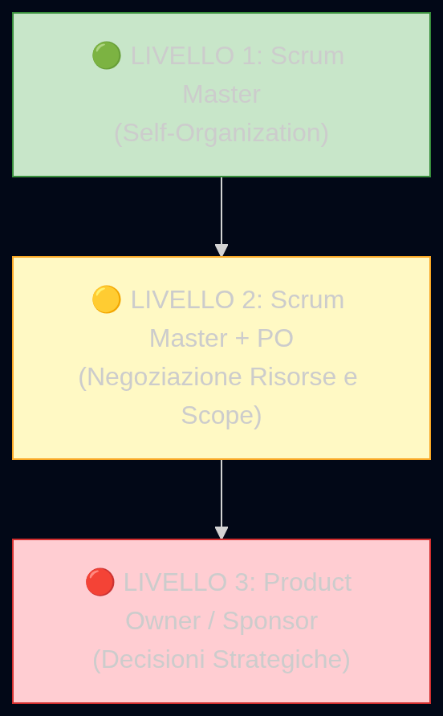
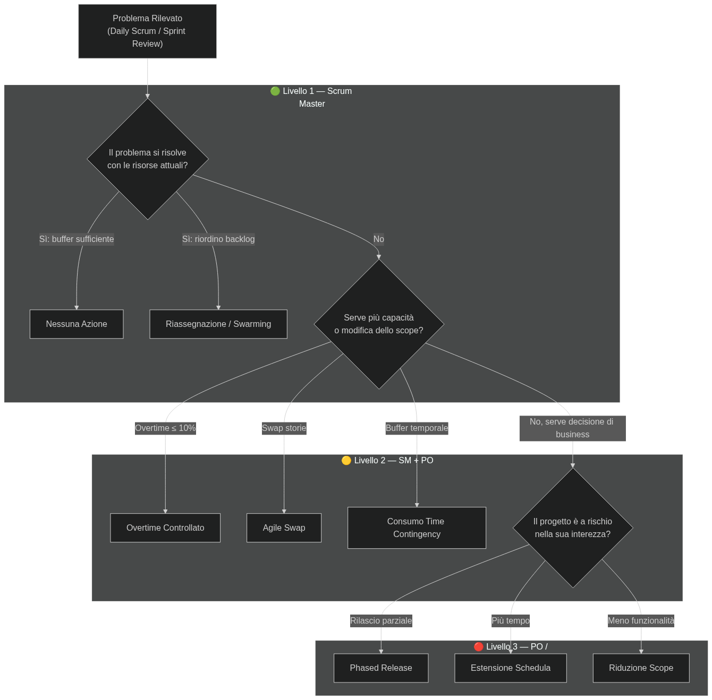

# Issues Log e Problem Escalation Strategy

Il presente documento definisce il registro dei problemi (Issues Log) emersi durante l'esecuzione del progetto "Hyrox Team Performance Optimizer" e la strategia gerarchica di escalation (Problem Escalation Strategy) adottata per la loro risoluzione. Entrambi gli strumenti sono stati gestiti e aggiornati durante i [Daily Scrum e i Problem Resolution Meeting](file:///home/zava/Projects/PM-project/Monitoring_Controlling/1-status_meetings_reporting.md) dallo Scrum Master.

---

## 1. Issues Log — Struttura e Governance

L'Issues Log è un documento dinamico che registra tutti i problemi emersi durante il progetto, con particolare attenzione a quelli non ancora risolti. Costituisce una preziosa fonte di dati storici per il team e per i progetti futuri.

La risoluzione tempestiva dei problemi riportati è fondamentale per la continuazione e il successo del progetto. L'Issues Log viene aggiornato ad ogni Daily Scrum (se emergono nuovi impedimenti) e rivisto formalmente durante i Problem Resolution Meeting.

### 1.1 Campi dell'Issues Log

| Campo | Descrizione |
| :--- | :--- |
| **ID** | Identificativo univoco del problema (ISS-XXX) |
| **Data** | Data di registrazione nel log |
| **Sprint** | Sprint in cui il problema è stato rilevato |
| **Descrizione** | Descrizione sintetica e oggettiva del problema |
| **Impatto** | Conseguenze sul progetto se il problema non viene risolto |
| **Owner** | Membro del team proprietario del problema (responsabile della risoluzione) |
| **Azione** | Misura correttiva concordata nel Problem Resolution Meeting |
| **Stato** | Aperto / In Corso / Risolto / Chiuso |
| **Esito** | Risultato finale della risoluzione e data di chiusura |

---

## 2. Issues Log — Registro Completo

### 2.1 Issues della Release 1 (Sprint 1-8)

| ID | Data | Sprint | Descrizione | Impatto se Non Risolto | Owner | Azione Intrapresa | Stato | Esito |
| :--- | :--- | :---: | :--- | :--- | :--- | :--- | :---: | :--- |
| **ISS-001** | 16 Feb 2026 | S2 | **Spike nelle latenze Bluetooth** durante la fase di test della connessione Watch→Phone su Apple Watch SE (1ª gen). Il trasferimento dati supera i 60s per sessione. | Ritardo nella validazione del protocollo di sincronizzazione e possibile impatto su US-S-01 (Sprint 8). | Sara Viola | Circoscritto il problema al chip Bluetooth W3 degli Apple Watch SE 1ª gen. La Device Compatibility List è stata aggiornata per escludere SE 1ª gen dal supporto. Nessuna modifica al codice. | **Risolto** | ✅ Chiuso Sprint 2. L'esclusione è coerente con i vincoli di progetto (Apple Watch Series 6+). |
| **ISS-002** | 18 Mar 2026 | S4 | **Dati accelerometrici rumorosi** durante lo Spike Tecnologico (US-TEC-03). I dati grezzi di accelerometro e giroscopio presentano artefatti di rumore ad alta frequenza durante la corsa a velocità >14 km/h, compromettendo il riconoscimento delle transizioni. | Rischio diretto sul gate Go/No-Go dello Sprint 12: accuratezza dell'algoritmo potenzialmente insufficiente. | Giovanni Manca | Implementazione di un **filtro di Kalman** nella pipeline di pre-processing dei dati inerziali. Il filtro è stato calibrato sui 10 dataset raccolti durante lo Spike. Riunione di Problem Resolution con Giovanni + Luca (2h). | **Risolto** | ✅ Chiuso Sprint 4. Il filtro ha ridotto il rumore del 78%. L'accuratezza preliminare in lab è salita dal 62% all'81%. |
| **ISS-003** | 1 Apr 2026 | S5 | **Interferenza tra Fallback Trigger e campionamento sensori.** La pressione contemporanea di Digital Crown + tasto laterale (gesto di fallback manuale, US-W-03) genera un picco anomalo nei dati dell'accelerometro, corrompendo il campionamento. | La US-W-03 non può essere completata. Carry-over di 2 SP nello Sprint successivo. Rischio di impatto sulla Release 1. | Luca Rossi | **Swarming** (Luca Rossi + Sara Viola) nello Sprint 6: isolamento del thread di input hardware dal thread di campionamento sensori tramite GCD (Grand Central Dispatch). Il gesto fisico viene ora catturato su un thread dedicato senza contaminare la pipeline di dati inerziali. | **Risolto** | ✅ Chiuso Sprint 6. US-W-03 completata. Nessun impatto sulla Release 1 (MVP). |
| **ISS-004** | 15 Apr 2026 | S6 | **Memory leak nella cache locale** (US-W-05) durante sessioni superiori a 3 ore. Il consumo di RAM cresce linearmente e causa un crash dell'app watchOS dopo circa 3,5 ore di registrazione continua. | L'app non è affidabile per sessioni di gara lunghe (una gara Hyrox può durare fino a 2,5 ore per i professionisti, ma fino a 4 ore per i principianti). | Luca Rossi | Ottimizzazione della strategia di scrittura su CoreData: passaggio da flush periodico ogni 5 secondi a batch writing ogni 30 secondi con buffer circolare in memoria (max 256 KB). Riduzione del footprint RAM del 65%. | **Risolto** | ✅ Chiuso Sprint 7. Test di stress superato per sessioni fino a 5 ore continuative. |

### 2.2 Issues della Release 2 (Sprint 9-11)

| ID | Data | Sprint | Descrizione | Impatto se Non Risolto | Owner | Azione Intrapresa | Stato | Esito |
| :--- | :--- | :---: | :--- | :--- | :--- | :--- | :---: | :--- |
| **ISS-005** | 27 Mag 2026 | S9 | **Rendering lento della tabella comparativa** (US-D-03) con 4 atleti e sessioni >60 minuti. Il tempo di caricamento della pagina supera i 5 secondi a causa delle query aggregate non ottimizzate. | Esperienza utente degradata per i coach. La CoS "analisi in meno di 2 minuti" è a rischio se il rendering consuma tempo. | Elena Bianchi | Implementazione di query aggregate pre-calcolate a livello di backend (materialized views in PostgreSQL). Paginazione lato server con lazy loading per stazioni non visibili. Il tempo di rendering è sceso a 1,2 secondi. | **Risolto** | ✅ Chiuso Sprint 9. Performance validata con dataset reali (4 atleti × 16 stazioni × 5 sessioni). |
| **ISS-006** | 10 Giu 2026 | S10 | **Complessità della macchina a stati per Skip & Riordina** (US-W-07). La logica di riallineamento della sequenza dell'allenamento dopo uno skip genera inconsistenze nei dati di telemetria esportati: il flag "Riordinato" non viene propagato correttamente al cloud. | I dati del coach sulla dashboard risultano incoerenti con la sessione reale dell'atleta, compromettendo l'affidabilità della visualizzazione comparativa. | Giovanni Manca | Refactoring della macchina a stati con pattern **State Machine** esplicito (enum Swift). Ogni transizione (automatica, manuale, skip, riordina) è ora un evento tipizzato nel log di sessione, propagato integralmente alla pipeline di sync. Code review a 4 occhi (Giovanni + Matteo). | **Risolto** | ✅ Chiuso Sprint 10. Test E2E superato con scenari di skip multipli consecutivi. |

### 2.3 Issues della Release 3 — Validazione (Sprint 12-16)

| ID | Data | Sprint | Descrizione | Impatto se Non Risolto | Owner | Azione Intrapresa | Stato | Esito |
| :--- | :--- | :---: | :--- | :--- | :--- | :--- | :---: | :--- |
| **ISS-007** | 8 Lug 2026 | S12 | **Accuratezza algoritmo al 88%** nei Lab Test (sotto la soglia del 90% del gate Go/No-Go). L'algoritmo confonde sistematicamente la transizione Sled Push → Corsa con Sled Pull → Corsa a causa della similarità biomeccanica dei due gesti. | Attivazione del Pivot al Plan B (Manual Trigger) e rimozione completa del tracciamento automatico. Impatto significativo sul Business Value del prodotto. | Giovanni Manca | Sessione straordinaria di Problem Resolution (3h, Giovanni + Luca + Andrea). Soluzione: aggiunta di un **vincolo di sequenza** basato sulla schedulazione del workout pre-caricata. L'algoritmo non decide più "quale stazione è" in assoluto, ma verifica se il pattern inerziale è **compatibile con la prossima stazione attesa** nella sequenza. Questo riduce lo spazio degli stati da 9 a 2 (stazione attesa vs corsa). | **Risolto** | ✅ Chiuso Sprint 13. Ri-test in lab con 15 coach e 30 atleti: **accuratezza salita al 94%**. Gate Go/No-Go superato. Piano B non attivato. |
| **ISS-008** | 20 Lug 2026 | S13 | **SUS Score iniziale 74/100** (sotto la soglia di 80/100). I test di usabilità rivelano che gli atleti faticano a leggere il display del watch durante gli esercizi ad alta intensità (Burpee Broad Jumps e Wall Balls) a causa delle vibrazioni del polso. | Criterio di successo del prodotto non soddisfatto. Il rilascio non può avvenire senza un SUS ≥ 80. | Elena Bianchi | Micro-correzioni all'UI watchOS: aumento della dimensione dei caratteri primari da 24pt a 28pt, introduzione di un **feedback aptico ritmico** (vibrazione leggera ogni 10 rep) come conferma tattile alternativa alla lettura visiva. Ri-test di usabilità con 10 atleti. | **Risolto** | ✅ Chiuso Sprint 14. SUS Score ri-testato: **83/100**. Criterio di successo soddisfatto. |

---

## 3. Problem Escalation Strategy

La strategia di escalation definisce una gerarchia a tre livelli per la risoluzione dei problemi, ordinata dal livello di intervento meno invasivo al più impattante. L'escalation viene attivata solo quando il livello corrente non è sufficiente a risolvere il problema.

### 3.1 Adattamento della Gerarchia al Framework Scrum

La strategia di escalation si articola su tre livelli gerarchici, adattati ai ruoli dell'organizzazione agile Scrum:

### 3.2 Dettaglio dei Tre Livelli

#### 🟢 Livello 1 — Scrum Master-Based Strategies (Auto-organizzazione del Team)

Sono le strategie che lo Scrum Master e il Dev Team possono applicare autonomamente, senza coinvolgere il Product Owner o lo Sponsor.

| Strategia | Descrizione | Adattamento Scrum | Esempio nel Progetto |
| :--- | :--- | :--- | :--- |
| **Nessuna azione richiesta** | Il problema si risolverà da solo grazie ai margini presenti. | Lo Sprint Backlog ha capacità residua (buffer del Focus Factor al 75%) sufficiente ad assorbire il ritardo. | ISS-001: il chip BT del SE 1ª gen è fuori scope. Basta aggiornare la compatibility list. |
| **Riassegnazione delle risorse** | Spostare risorse dai task non critici ai task bloccanti. | **Swarming:** più sviluppatori convergono sulla stessa User Story critica per lo Sprint Goal, sospendendo temporaneamente task non bloccanti. | ISS-003: Luca + Sara in swarming sulla US-W-03 nello Sprint 6 (risolto in 4 giorni). |
| **Riesame delle dipendenze** | Verificare se riordinando le attività si può sbloccare il percorso. | Riordinamento degli item nello Sprint Backlog: anticipare i task indipendenti per sbloccare il percorso critico dello Sprint Goal. | ISS-004: la risoluzione del memory leak (US-W-05) è stata anticipata nel backlog dello Sprint 7 rispetto alla stesura dei test automatici. |

#### 🟡 Livello 2 — Negoziazione Risorse e Scope (Scrum Master + Product Owner)

Si attiva quando le strategie di Livello 1 non sono sufficienti. Coinvolge il Product Owner per negoziare modifiche alla capacità o allo scope dello Sprint.

| Strategia | Descrizione | Adattamento Scrum | Esempio nel Progetto |
| :--- | :--- | :--- | :--- |
| **Overtime controllato** | Estendere temporaneamente le ore di lavoro del team. | Limitato al **10% della capacità dello Sprint** (max 8h/dev per Sprint), concordato internamente al team. Ultima risorsa prima della negoziazione di scope. | Sprint 5: +12h di overtime totale del Dev Team per contenere il carry-over della US-W-03. |
| **Negoziare un Agile Swap** | Rimuovere o posticipare storie per fare spazio nel backlog. | Il PO applica la regola del [Fixed Capacity Trading](file:///home/zava/Projects/PM-project/Launching/3-scope_change_management.md#11-la-regola-di-scambio-fixed-capacity-trading-rule): le nuove urgenze entrano solo se storie di pari SP escono dalla release corrente. | SWAP-01 (Sprint 2): US-W-07 anticipata in Release 1, 3 US posticipate in Release 2 (bilancio -1 SP). |
| **Consumo della Time Contingency** | Utilizzare il buffer temporale accantonato. | Il team attinge alla riserva del 10% (~1,6 Sprint) per assorbire i ritardi senza impattare le date di release. | Sprint 5: il carry-over di 2 SP è stato assorbito dal buffer di capacità, recuperato nello Sprint 6. |

#### 🔴 Livello 3 — Product Owner / Sponsor-Based Strategies (Decisioni Strategiche)

Si attiva quando il problema è tale da richiedere una decisione di business che impatta gli obiettivi del progetto.

| Strategia | Descrizione | Adattamento Scrum | Esempio nel Progetto |
| :--- | :--- | :--- | :--- |
| **Rilascio multiplo (Phased Release)** | Suddividere il rilascio in più fasi per consegnare prima il valore essenziale. | Già previsto nel progetto tramite le 3 Release (MVP → Analytics → Validation). In caso di crisi, il PO può decidere di rilasciare solo la Release 1 come prodotto minimo. | Strategia disponibile ma **non attivata**: tutte e 3 le release sono state consegnate nei tempi. |
| **Estensione della schedula** | Richiedere allo Sponsor un'estensione della deadline. | Il PO (Chiara Bertocchi) negozia con il board un'estensione del timebox di progetto. Implica costi aggiuntivi. | Strategia disponibile ma **non attivata**: i 16 Sprint sono stati sufficienti. |
| **Modifica di scope** | Ridurre formalmente lo scope del prodotto per rispettare tempi e budget. | Il PO rimuove definitivamente delle User Story dal Product Backlog (non le posticipa, le elimina). Richiede l'approvazione dello Sponsor. | Strategia disponibile ma **non attivata**. ISS-007 (accuratezza 88%) avrebbe potuto innescare il **Pivot al Plan B** (eliminazione del tracciamento automatico), ma il problema è stato risolto a Livello 1 con il vincolo di sequenza. |

### 3.3 Gerarchia di Escalation applicata — Flusso Decisionale

---

## 4. Riepilogo delle Escalation effettivamente attivate

Durante l'intero ciclo di vita del progetto (16 Sprint), sono state registrate **8 issue** e le escalation si sono distribuite come segue:

| Livello di Escalation | Issue Gestite | Dettaglio |
| :---: | :---: | :--- |
| 🟢 **Livello 1** (Scrum Master) | **6 su 8** | ISS-001, ISS-002, ISS-004, ISS-005, ISS-006, ISS-007 — Risolte con swarming, refactoring, ottimizzazioni o aggiornamento delle specifiche. |
| 🟡 **Livello 2** (SM + PO) | **2 su 8** | ISS-003 (overtime +12h nello Sprint 5) e ISS-008 (micro-correzioni UI post-test usabilità, con ri-test concordato con il PO). |
| 🔴 **Livello 3** (PO / Sponsor) | **0 su 8** | Nessuna issue ha richiesto decisioni strategiche di business (estensione schedula, riduzione scope o rilascio parziale). |

> [!TIP]
> **Lettura del riepilogo:** Il fatto che il 75% delle issue sia stato risolto a Livello 1 (auto-organizzazione del team) conferma l'efficacia del modello Scrum adottato e la maturità del Dev Team. L'assenza di escalation a Livello 3 dimostra che la pianificazione dello scope, la gestione dei rischi (Spike, Contingency) e i meccanismi di Agile Swap hanno funzionato come previsto.

---

## Appendice: Template dell'Issues Log (Blank Form)

Per garantire la tracciabilità e la riproducibilità del processo, viene qui riportato il template vuoto dell'Issues Log:

| ID | Data | Sprint | Descrizione del Problema | Impatto sul Progetto | Owner del Problema | Azione da Intraprendere | Stato | Esito |
| :--- | :--- | :---: | :--- | :--- | :--- | :--- | :---: | :--- |
| `ISS-XXX` | `GG/MM/AAAA` | `SX` | *[Descrizione oggettiva]* | *[Conseguenze se non risolto]* | *[Nome e ruolo]* | *[Misura correttiva concordata]* | `Aperto` | *[Risultato finale e data chiusura]* |

---

*Documento redatto e aggiornato dallo Scrum Master Andrea Zavatta. Le issue sono state tracciate su Jira (label: IMPEDIMENT) e discusse nei Problem Resolution Meeting con verbale archiviato su Confluence.*
