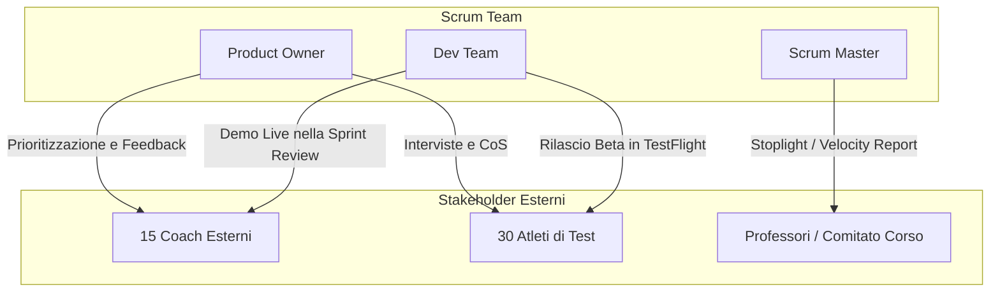

# Agile Communication & Stakeholder Engagement Plan

Il presente documento definisce la strategia di comunicazione e di coinvolgimento degli stakeholder. La comunicazione del progetto è progettata per essere trasparente, frequente ed empirica, eliminando la reportistica tradizionale a favore di cicli di feedback rapidi e dell'ispezione diretta del prodotto.

---

## 1. Governance dei Canali di Comunicazione con gli Stakeholder

Per garantire una collaborazione trasparente ed efficace senza sovraccaricare le attività operative dello Scrum Team, i canali di comunicazione sono strutturati in base alle esigenze dei diversi stakeholder esterni:

*   **TestFlight (Beta Testing):** Al completamento delle milestone principali, gli atleti ricevono la build in formato beta per testarla sul campo, consentendo la raccolta empirica dei dati di usabilità.
*   **Miro:** Utilizzato come spazio visuale condiviso per sessioni di co-design. I coach possono inserire commenti sui wireframe dell'interfaccia utente (UI/UX) della Dashboard Web per ottimizzare la visualizzazione dei grafici di pacing.
*   **E-mail & Stoplight Report:** Canale formale utilizzato a cadenza mensile (ogni 2 Sprint) dal Scrum Master per comunicare l'avanzamento complessivo del progetto tramite report sintetici di status, grafici di Velocity ed evidenziazione dei rischi tecnologici.
*   **Jira & Confluence:** Confluence ospita la documentazione della Roadmap di rilascio e la pianificazione di alto livello visibile a tutti gli stakeholder. Jira funge da repository in cui il Product Owner inserisce e prioritizza le User Story nate direttamente dal feedback degli stakeholder esterni.

---

## 2. Eventi di Sincronizzazione e Touchpoint con gli Stakeholder

La sincronizzazione con gli stakeholder avviene  attraverso touchpoint negli Sprint:

| Touchpoint | Frequenza | Partecipanti Coinvolti | Input Principale | Output Principale | Canale / Modalità |
| :--- | :--- | :--- | :--- | :--- | :--- |
| **Sprint Review (Demo Live)** | Ogni 2 settimane (fine Sprint, max 1 ora) | Scrum Team, 15 Coach, Atleti di test | Incremento software funzionante (DoD soddisfatta) | Feedback utente, nuove proposte di requisiti nel backlog | Demo dal vivo del software su smartwatch e Dashboard Web. **No slide.** |
| **Sessioni di Co-Design UI/UX** | Asincrona (fase di design iniziale o refactoring) | Product Owner, Tech Lead, Coach | Wireframe su Miro, requisiti utente | Modelli UI approvati, specifiche visive | Lavagna collaborativa virtuale Miro con sessioni asincrone di feedback. |
| **Field Testing & Usability Sync** | Al rilascio delle Milestone (es. Sprint 4, 8, 12) | Scrum Master, Atleti di test | Build beta su TestFlight | Report SUS (System Usability Scale), ticket di anomalia | Distribuzione tramite TestFlight e successiva compilazione di brevi questionari. |
| **Steering Committee Reporting** | Mensile (ogni 2 Sprint) | Scrum Master, Docenti del Corso | Velocity Chart (Burnup/Burndown), Risk Log | Approvazione dello stato di avanzamento | E-mail formale con allegato Stoplight Report e metriche di performance. |

> [!NOTE]
> Le cerimonie interne del team (come *Sprint Planning*, *Daily Scrum* e *Sprint Retrospective*), incentrate sul coordinamento operativo e sul miglioramento dei processi interni del team, sono escluse da questo piano in quanto riservate esclusivamente allo Scrum Team. Per le loro regole di svolgimento si rimanda ai [Working Agreements](file:///home/zava/Projects/PM-project/Planning/2-working_agreements.md#2-ritmo-di-lavoro-e-cerimonie-scrum).

---

## 3. Matrice di Coinvolgimento degli Stakeholder (Stakeholder Engagement)

Il successo del sistema dipende da una stretta collaborazione con gli utenti finali della palestra partner. La matrice definisce il coinvolgimento dei diversi attori nel ciclo di vita Scrum:



### 3.1 Product Owner (PO)
*   **Ruolo:** Unico punto di contatto per la definizione del valore di business.
*   **Coinvolgimento:** Partecipa attivamente a tutti gli eventi Scrum. Raccoglie i desiderata dei coach esterni e li sintetizza nel Product Backlog. Ha l'autorità esclusiva di accettare le storie completate durante la Sprint Review.

### 3.2 I 15 Coach della Palestra Partner
*   **Ruolo:** Utenti chiave della Dashboard Web.
*   **Coinvolgimento:**
    *   **Sprint Review:** Partecipano come invitati principali ogni 2 settimane per validare i moduli della Dashboard (compilatore di workout, analisi split-times del team, pannello sanzioni).
    *   **Co-Design:** Collaborano asincronamente sulla board Miro durante la fase di design della UI/UX per garantire che i grafici di pacing siano di facile lettura sul campo di allenamento.

### 3.3 I 30 Atleti del Gruppo di Test
*   **Ruolo:** Utenti chiave dell'applicazione Smartwatch e generatori dei dati di telemetria.
*   **Coinvolgimento:**
    *   **Beta Testing (TestFlight):** Ricevono i rilasci dell'app ad ogni conclusione di Sprint (es. al termine dello Sprint 4 per il modulo di navigazione, o dello Sprint 12 per il rilascio finale dell'algoritmo).
    *   **Validazione sul Campo:** Eseguono sessioni di allenamento simulate indossando Apple Watch Series 6+. I loro feedback sull'usabilità dell'interfaccia (es. leggibilità sotto sforzo estremo e utilità del feedback aptico) vengono raccolti tramite brevi questionari e inseriti direttamente come nuove storie nel Backlog.

### 3.4 
Steering Committee
*   **Ruolo:** Organo di controllo accademico del progetto.
*   **Coinvolgimento:**
    *   **Report di Status Mensile:** Al termine di ogni secondo Sprint (mensilmente), il Scrum Master invia un report sintetico contenente la **Velocity del team (Burnup/Burndown chart)** e un breve **Stoplight Report** sullo stato dei rischi critici (in particolare l'accuratezza del classificatore dei sensori).

---

## 4. Ciclo di Feedback Empirico e Adattamento

In Scrum puro, il feedback degli stakeholder viene integrato dinamicamente nel ciclo empirico del prodotto:

```
[Demo Funzionante in Sprint Review] 
               │
               ▼
[Feedback di Coach e Atleti]
               │
               ▼
[Scrittura di Nuove User Story / Bug da parte del PO]
               │
               ▼
[Stima del Dev Team in Refinement (Story Points)]
               │
               ▼
[Prioritizzazione nel Product Backlog per lo Sprint Planning successivo]
```

Grazie a questo ciclo continuo di ispezione e adattamento, il sistema "Hyrox Team Performance Optimizer" evolve in base alle reali necessità del campo, garantendo la massima aderenza alle *Conditions of Satisfaction (CoS)* definite all'inizio del progetto.
