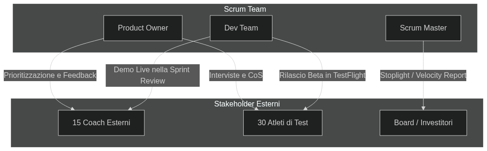

# Governance & Communication

La governance del progetto garantisce la qualità e l'allineamento con gli stakeholder, evitando la burocrazia inutile.

## 1. Coinvolgimento degli Stakeholder

Il successo del sistema dipende da una stretta collaborazione con gli utenti finali (Coach e Atleti). Il ciclo di feedback avviene esclusivamente alla fine di ogni Sprint durante la **Sprint Review**, dove viene mostrato software funzionante, o tramite sessioni di co-design asincrone su Miro.

---

## 2. Standard di Qualità (DoR & DoD)

La qualità del software e il controllo dello Scope sono garantiti a livello di processo attraverso due filtri fondamentali gestiti dal Product Owner e dal Tech Lead:

### Definition of Ready (DoR) - *Criteri per iniziare lo sviluppo*
Una User Story entra in uno Sprint solo se rispetta il formato **INVEST**:
*   Indipendente, Negoziabile, di Valore per il business, Stimabile (in Story Points), Piccola (<= 8 SP) e Testabile.

### Definition of Done (DoD) - *Criteri per considerare il lavoro concluso*
L'incremento viene mostrato agli stakeholder nella Review solo se rispetta questi standard tecnici (Engineering Practices):
1.  **Branching & Integrazione:** Il codice risiede in un `feature/branch`, fuso in `develop` per i test, e approvato tramite **Pull Request (PR)** nel branch `review`.
2.  **Code Review:** La PR è stata approvata da almeno 1 Senior Developer / Tech Lead.
3.  **Testing:** La suite di Unit Test nella pipeline CI/CD passa con successo. La logica di business e gli algoritmi hanno un **Code Coverage >= 80%**.
4.  **Validazione Empirica:** L'app per smartwatch è distribuita su TestFlight per i test sul campo degli atleti (con obiettivo SUS Score >= 80/100 per l'usabilità).
